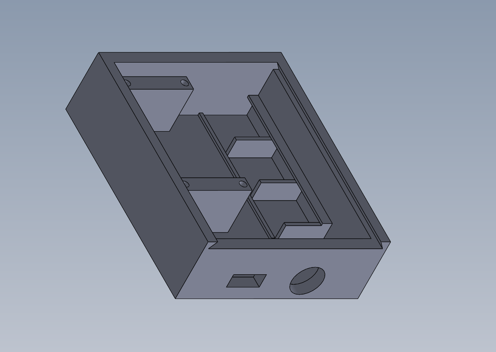

# LED_WEB

A smart LED lighting control system that integrates WS2812B RGB LED strips with Home Assistant and a Flask web interface for flexible, remote-free control.

## Overview

This project controls a WS2812B RGB LED strip connected to an ESP32 by interfacing with:
- **Home Assistant** server on the local network for smart home integration
- **Flask web server** providing a locally hosted webpage for light control

### Key Features

- **No Remote Required**: Control lights through Home Assistant or web interface
- **Easy Updates**: Web-based interface allows software updates without hardware changes
- **Real-Time Audio Visualization**: USB microphone on the server provides live audio data for music-reactive lighting effects

### Available Lighting Modes

- Solid color display
- Breathing color display
- Audio-visualizer color display
- Color spectrum

## Configuration

### env.h File (ESP32 Arduino Sketch)

Create an `env.h` file in the project root directory with the following configuration values:

```cpp
#ifndef ENV_H
#define ENV_H

// WiFi Configuration
const char* WIFI_SSID = "your_wifi_ssid";
const char* WIFI_PASSWORD = "your_wifi_password";

// Home Assistant Configuration
const char* HA_HOST = "http://YOUR_HA_IP:8123";
const char* HA_TOKEN = "your_home_assistant_long_lived_access_token";

// Home Assistant Entity IDs
const char* HA_IP_ENTITY = "input_text.desk_esp_ip";
const char* HA_LED_STATE_ENTITY = "input_text.desk_esp_state";

// LED Strip Configuration
#define LED_PIN  5
#define NUM_LEDS 300

#endif
```

**Configuration Details:**

- **WIFI_SSID**: Your local WiFi network name
- **WIFI_PASSWORD**: Your WiFi password
- **HA_HOST**: Home Assistant server URL (format: `http://IP_ADDRESS:8123`)
- **HA_TOKEN**: Long-lived access token from Home Assistant (Generate in: Profile → Long-Lived Access Tokens)
- **HA_IP_ENTITY**: Home Assistant input_text entity to store the ESP32's IP address
- **HA_LED_STATE_ENTITY**: Home Assistant input_text entity to store the LED state
- **LED_PIN**: GPIO pin on the ESP32 connected to the LED strip data line (default: GPIO 5)
- **NUM_LEDS**: Total number of LEDs in your strip

### .env File (Flask Web Server)

Create a `.env` file in the project root directory for the Flask web server:

```
HA_HOST=http://YOUR_HA_IP:8123
HA_TOKEN=your_home_assistant_long_lived_access_token
FLASK_PORT=5000
```

**Configuration Details:**

- **HA_HOST**: Home Assistant server URL (should match the one in env.h)
- **HA_TOKEN**: Long-lived access token from Home Assistant (should match the one in env.h)
- **FLASK_PORT**: Port number for the Flask web server (default: 5000)

## 3D Printed Enclosure



The [3D print files](3D%20print%20files/) folder contains STL files for a custom enclosure to house the ESP32 and wire connections, including a lid for the box.

### Required Components

1. **USB-C Connector**: [USB-C Panel Mount Cable](https://a.co/d/ibNtGKY)
2. **WAGO Lever Nut Connectors**: [3-conductor lever nuts × 3](https://a.co/d/3chznWW)
3. **ESP32 Board**: [ESP32 DOIT DevKit V1](https://a.co/d/75TbzBZ)
4. **LED Strip**: [WS2812B LED Strip](https://a.co/d/dlXuyIC)
5. **M3×8 Screws**: 4× screws to secure the ESP32 to the box

### Wiring Connections

Use the three WAGO lever nut connectors to make the following connections:

**Connector 1 (Power +):**
- VIN pin of ESP32
- Positive (+) wire of USB-C connector
- Positive (+) wire of LED strip

**Connector 2 (Ground -):**
- GND pin of ESP32
- Negative (-) wire of USB-C connector
- Negative (-) wire of LED strip

**Connector 3 (Data Signal):**
- Data/TRIG pin of LED strip
- GPIO pin of ESP32 (as defined by `LED_PIN` in env.h, default: GPIO 5)
